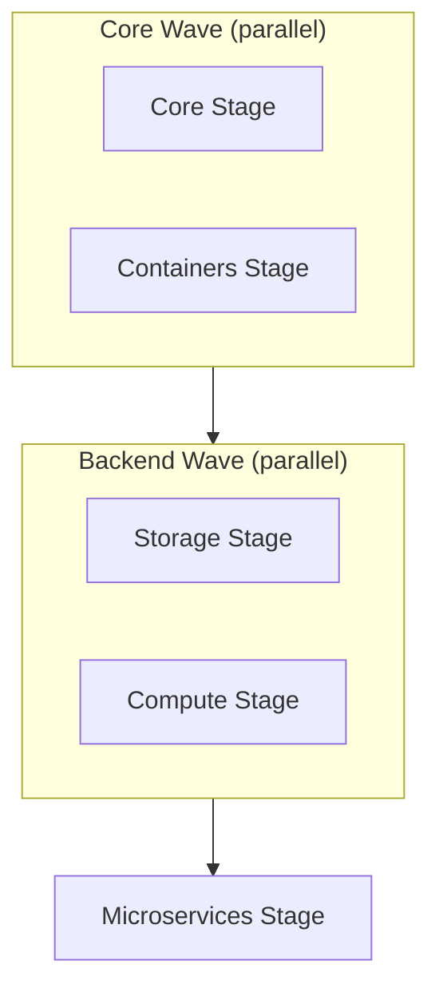

# Deployment Stages

## 1. Core Stage

Deploys foundational infrastructure required by all other stages.

- VPC with public/private subnets, NAT gateways
- VPC Endpoints for private AWS service connectivity (SSM, SSM Messages, EC2 Messages, Secrets Manager, CloudWatch Logs, CloudWatch Monitoring, Lambda, API Gateway, Cloud Map, S3, DynamoDB)
- Security groups and IAM roles
- CloudTrail audit logging
- EventBridge event bus
- Amazon SQS queue with dead-letter queue for async messaging

## 2. Containers Stage

Builds and pushes container images for all microservices using a dedicated CodePipeline.

| Service | Language | Architecture |
|---------|----------|-------------|
| `payforadoption-go` | Go | AMD64 |
| `petlistadoption-py` | Python/FastAPI | AMD64 |
| `petsearch-java` | Java/Spring Boot | AMD64 |
| `petsite-net` | .NET | AMD64 |
| `petfood-rs` | Rust/Axum | AMD64 |
| `petfoodagent-strands-py` | Python/Strands | ARM64 |

Pipeline: Source Stage → Parallel Build Stage (all 6 services)

## 3. Storage Stage

Deploys data persistence and messaging resources.

- **Amazon DynamoDB** — Pet adoption, pet foods, and pet foods cart tables
- **Amazon Aurora PostgreSQL** — Relational database for structured data
- **Amazon S3** — Workshop assets bucket with pet images, CloudFront CDN

Post-deployment steps: DynamoDB seeding and RDS seeding run as CodeBuild steps.

## 4. Compute Stage

Deploys container orchestration platforms and optional search infrastructure.

- **Amazon ECS** — Fargate cluster for microservice tasks
- **Amazon EKS** — Kubernetes cluster with managed node groups (EC2)
- **Application Load Balancers** — Traffic distribution for ECS and EKS
- **Container Insights** — Enabled on both clusters
- **OpenSearch Serverless** — Collection, ingestion pipeline, and application (optional, requires `ENABLE_OPENSEARCH=true`)

!!! note
    Lambda functions and microservice task definitions are deployed in the Microservices Stage, not here. This stage only creates the clusters and load balancers.

## 5. Microservices Stage

Deploys all microservices, serverless functions, canaries, and WAF rules.

### Microservices

- 4 ECS services: payforadoption-go, petlistadoptions-py, petsearch-java, petfood-rs
- 1 EKS deployment: petsite-net (with CloudFront distribution)
- 1 Bedrock AgentCore deployment: petfoodagent-strands-py

### Lambda Functions

| Function | Runtime | Purpose |
|----------|---------|---------|
| StatusUpdater | Node.js | Updates pet adoption status in DynamoDB |
| UserCreator | Python | Creates user records in Aurora PostgreSQL |
| RdsSeeder | Python | Seeds Aurora PostgreSQL |
| TrafficGenerator | Node.js | Generates synthetic traffic |
| PetfoodStockProcessor | Node.js | Processes food stock events from EventBridge |
| PetfoodImageGenerator | Python | Generates pet food images via Bedrock |
| PetfoodCleanupProcessor | Node.js | Cleans up expired food listings |
| DynamoCapacityTest | Python | DynamoDB write capacity testing |

### Canaries

- **TrafficGeneratorCanary** — CloudWatch Synthetics canary for continuous traffic
- **HousekeepingCanary** — Periodic cleanup of stale resources

### WAF (optional)

- Regional WAF on ALB (requires `CUSTOM_ENABLE_WAF=true`)
- Global WAF on CloudFront (requires `CUSTOM_ENABLE_WAF=true`)

## Stage Dependencies

